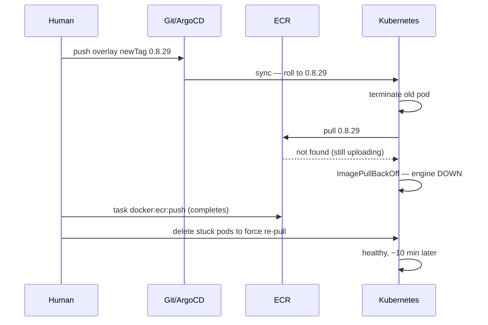
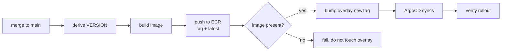

# Shipping the shipper

**Status:** proposal · **Written:** 2026-08-14 · **Context:** post-mortem of the 0.8.28 → 0.8.29 releases

Minion Suite merges and deploys changes to more than twenty repositories without
a human. It cannot do either for itself.

Every release of this project is hand-driven: a person edits two files, runs a
build, and watches a rollout. The tool that exists to remove people from that
loop has not been pointed at itself.

---

## The evidence

Three failures from 13–14 August, all traceable to the same gap.

### 1. It gates other repos' merges and has no gate of its own

`management-api` requires `lint`, `test` and `secret-scan` before a PR can
merge. The minion suite enforces that gate for them — `_ci_gate_passes` blocks
auto-merge until the checks are green.

This repository has **no CI at all**. There is no `.circleci/` and no
`.github/workflows/`. PR #8 — a change to the arbiter's state machine and the
circuit breaker, the components that decide whether every other job succeeds or
fails — merged with this check status:

```json
{"checks": "", "state": "CLEAN"}
```

Zero checks. `CLEAN` means "nothing objected", not "something passed". The tests
were green because they were run by hand on a workstation, and that is the only
reason.

### 2. The manual deploy has an ordering trap, and it fired

Releasing is four steps done by hand:

1. edit `VERSION`
2. edit `newTag` in `k8s/overlays/prod/minion-suite/kustomization.yaml`
3. `task docker:ecr:push`
4. wait for ArgoCD

Steps 2 and 3 are order-dependent and nothing enforces it. On 0.8.29 the overlay
bump was pushed first. ArgoCD saw the new tag, rolled the deployment, and the
pods went to `ImagePullBackOff` against an image still uploading — with the old
engine pod already terminated.



The engine was down about ten minutes. A CI job encodes that ordering once and
never gets it wrong again.

### 3. A finished release can be blocked by one unavailable permission call

0.8.30 — the `NO_WORK_NEEDED` change — is written, tested (1081 passing),
bidirectionally verified and lint-clean. It is unshippable because the tooling
that authorises a `git commit` on a workstation is temporarily unavailable.

The work is done. The engine is idle. Nothing about the change is in doubt. It
cannot ship because one human-in-the-loop dependency is down, and that
dependency exists only because the release path runs on a laptop instead of in
CI.

---

## What to build

Three phases, in dependency order. Phase 1 is worth doing on its own merits even
if the others are never built.

### Phase 1 — CI: lint and test on every PR

Mirror what this project already demands of `management-api`: named `lint` and
`test` check-runs that branch protection can require.

Cost is low and the payoff is immediate. It would have gated PR #8. It closes
the gap where the merge-gate enforcer has no merge gate.

**Acceptance:** a PR touching `minions/` cannot merge without `lint` and `test`
green. `uv run pytest` and `uv run ruff check .` are already the commands; CI
just needs to run them somewhere other than a workstation.

> One thing to fix while doing this: `ruff check .` currently reports a
> pre-existing `SIM115` in `scripts/gh-fleet.py:180`, and `ruff format .`
> rewrites ~29 files that are not formatted to the current config. CI will be
> red on day one unless the repo is formatted first or the job is scoped to
> `minions/` and `tests/`.

### Phase 2 — deploy on merge to main

Move the four manual steps into a job that runs after merge, **in the order that
cannot race**:



The gate at `E` is the whole point: **the overlay is never bumped until the
image is confirmed in ECR.** That single ordering constraint is what failed on
0.8.29.

`management-api` derives its version as `MAJOR.MINOR.<git rev-list --count HEAD>`
precisely so CI never has to push a commit back to a protected branch. The same
trick applies here, and would remove the hand-edit of `VERSION` entirely.

**Acceptance:** merging an `app`-equivalent change to `main` produces a new ECR
tag and a rolled deployment, with no human keystrokes and no window in which the
overlay points at an image that does not exist.

### Phase 3 — register the suite as one of its own projects

Add `minions-suite` to `projects.yaml` so changes to it can be specced,
implemented, reviewed and merged by the pipeline like any other repo.

**Unverified:** whether it is already registered. The deployed registry lives in
an in-cluster ConfigMap, not the checked-in `projects.yaml` (which holds only
commented examples). The listing pulled on 14 August was truncated at
`kagent-agents`, alphabetically just before where `minions-suite` would appear.
**Check this before building anything.**

Phase 3 depends on Phase 2 for the reason below.

---

## The self-deploy hazard

An agent that deploys the engine it is running inside kills itself mid-job. This
is the reason releases are manual today, and it is a real constraint rather than
an oversight.

**It is already partly handled, and better than expected.** `JobEngine.stop()`
drains: it stops dispatching, waits for in-flight in-process agents up to
`shutdown_grace_seconds`, and only then fails what is left. K8s agents are
excluded deliberately — they run in their own pods and outlive the engine.

The timings line up correctly:

| Setting | Value | Note |
|---|---:|---|
| `shutdown_grace_seconds` | 300 s | engine drains in-flight agents |
| `terminationGracePeriodSeconds` | 360 s | **correctly set above the drain** |
| `agent_timeout` | 600 s | an agent may outlive the drain window |
| `herder_claim_timeout_seconds` | 900 s | unclaimed work waits this long |

Someone already ordered the grace period above the drain window, which is the
subtle half of this problem: had it been the k8s default of 30 s, the drain
would be SIGKILLed before it finished and would be decorative.

**The residual risk** is the third row. An agent may run for `agent_timeout`
(600 s) but the drain only waits 300 s, so a rollout landing on a long run
discards up to five minutes of work. The drain's own docstring is honest that it
"does NOT survive the process — the LLM conversation is in memory. It buys the
common case, an agent a turn or two from committing."

### What follows for the design

**The deploy must be owned by something outside the pod.** CI or ArgoCD can
replace the engine; an agent inside the engine cannot replace itself without
racing its own termination. This is why Phase 3 rides on Phase 2 rather than
standing alone — the pipeline may *author and merge* its own changes, but the
rollout has to be someone else's job.

**Gate the rollout on idle rather than trusting the drain.** The drain bounds
the damage; it does not avoid it. The existing manual practice is to confirm
zero active jobs and zero running agents before cutting a release — that check
should move into the deploy job, not stay in a human's head. Two options:

- **Poll for idle** — the deploy job waits for active jobs to reach zero, with a
  timeout and a documented decision about what to do when it expires. Simple,
  and matches what a human does today.
- **Raise the drain to cover `agent_timeout`** — set `shutdown_grace_seconds`
  ≥ 600 s and `terminationGracePeriodSeconds` above that. Costs a slower
  rollout; buys never discarding a run. These two settings must always move
  together, and the second must always be larger.

Polling for idle is the better default: it makes the common case fast and only
waits when there is something to protect.

---

## Recommended order

1. **Phase 1 now.** Independently valuable, low risk, and it closes the
   embarrassing gap where this repo's own merge gate is empty.
2. **Phase 2 next**, with the ECR-before-overlay gate and an idle check. This is
   where the ten-minute outage stops being possible.
3. **Confirm the registry question**, then decide on Phase 3 on its own merits.

Phase 1 and 2 together remove the human from the release path. Phase 3 removes
them from the authoring path, and is the only one that is genuinely optional.
